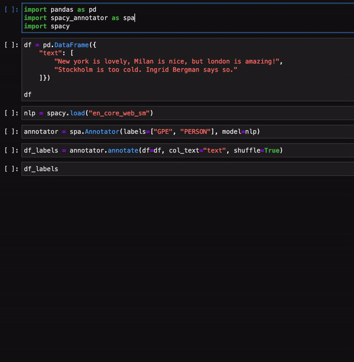

# spacy-annotator
SpaCy annotator for Named Entity Recognition (NER) using ipywidgets.

The annotator allows users to quickly assign custom labels to one or more entities in the text.   
The annotations adhere to SpaCy format and are ready to serve as input to Spacy NER model.   
No additional code required!

## Example code
```python
from annotator.annotator import annotate
import pandas as pd
import re

df = pd.DataFrame.from_dict({'text':['I bought lots of books in Berlin.']})

annotations = annotate(df['text'],
                      labels = ['Product', 'City'],
                      shuffle = True,
                      regex_flags = re.IGNORECASE)

print(annotations)
```

## Preview


## Contributing
1. Fork the repo on GitHub;
2. Clone the project to your own machine;
3. Commit changes to your own branch; and
4. Push your work back up to your own fork;
5. Submit a Pull request so that I can review your changes.

## Version
ipywidgets: 7.5.1   
re: 2.2.1

## Credits
spacy-annotator is based on [SpaCy](https://spacy.io/) and [pigeon](https://github.com/agermanidis/pigeon).   
Many thanks to them for making their awesome library publicly available.
